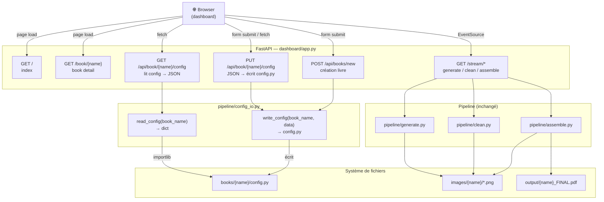

# Architecture — KDP Dashboard Config Editor

```mermaid
graph TD
    Browser["🌐 Browser\n(dashboard)"]

    subgraph FastAPI["FastAPI — dashboard/app.py"]
        R_INDEX["GET /\nindex"]
        R_BOOK["GET /book/{name}\nbook detail"]
        R_API_GET["GET /api/book/{name}/config\nlit config → JSON"]
        R_API_PUT["PUT /api/book/{name}/config\nJSON → écrit config.py"]
        R_NEW["POST /api/books/new\ncréation livre"]
        R_STREAM["GET /stream/*\ngenerate / clean / assemble"]
    end

    subgraph ConfigIO["pipeline/config_io.py"]
        FN_READ["read_config(book_name)\n→ dict"]
        FN_WRITE["write_config(book_name, data)\n→ config.py"]
    end

    subgraph FS["Système de fichiers"]
        CFG["books/{name}/config.py"]
        IMGS["images/{name}/*.png"]
        PDF["output/{name}_FINAL.pdf"]
    end

    subgraph Pipeline["Pipeline (inchangé)"]
        GEN["pipeline/generate.py"]
        CLEAN["pipeline/clean.py"]
        ASSEMBLE["pipeline/assemble.py"]
    end

    Browser -->|"form submit / fetch"| R_API_PUT
    Browser -->|"page load"| R_INDEX
    Browser -->|"page load"| R_BOOK
    Browser -->|"fetch"| R_API_GET
    Browser -->|"form submit"| R_NEW
    Browser -->|"EventSource"| R_STREAM

    R_API_GET --> FN_READ
    R_API_PUT --> FN_WRITE
    R_NEW --> FN_WRITE

    FN_READ -->|"importlib"| CFG
    FN_WRITE -->|"écrit"| CFG

    R_STREAM --> GEN
    R_STREAM --> CLEAN
    R_STREAM --> ASSEMBLE

    GEN --> IMGS
    CLEAN --> IMGS
    ASSEMBLE --> IMGS
    ASSEMBLE --> PDF
```
