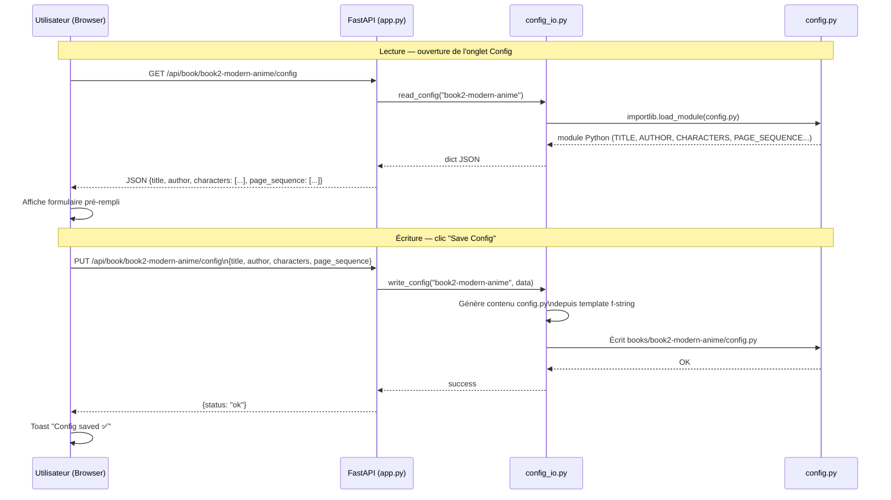

# Data Flow — Lecture et écriture de config.py

```mermaid
sequenceDiagram
    participant U as Utilisateur (Browser)
    participant API as FastAPI (app.py)
    participant IO as config_io.py
    participant FS as config.py

    Note over U,FS: Lecture — ouverture de l'onglet Config

    U->>API: GET /api/book/book2-modern-anime/config
    API->>IO: read_config("book2-modern-anime")
    IO->>FS: importlib.load_module(config.py)
    FS-->>IO: module Python (TITLE, AUTHOR, CHARACTERS, PAGE_SEQUENCE...)
    IO-->>API: dict JSON
    API-->>U: JSON {title, author, characters: [...], page_sequence: [...]}
    U->>U: Affiche formulaire pré-rempli

    Note over U,FS: Écriture — clic "Save Config"

    U->>API: PUT /api/book/book2-modern-anime/config\n{title, author, characters, page_sequence}
    API->>IO: write_config("book2-modern-anime", data)
    IO->>IO: Génère contenu config.py\ndepuis template f-string
    IO->>FS: Écrit books/book2-modern-anime/config.py
    FS-->>IO: OK
    IO-->>API: success
    API-->>U: {status: "ok"}
    U->>U: Toast "Config saved ✅"
```
