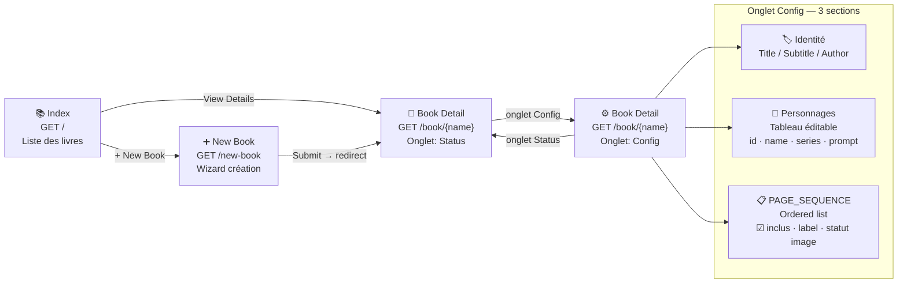

# Navigation UI — Pages et onglets du dashboard

```mermaid
graph LR
    INDEX["📚 Index\nGET /\nListe des livres"]
    BOOK_STATUS["📖 Book Detail\nGET /book/{name}\nOnglet: Status"]
    BOOK_CONFIG["⚙️ Book Detail\nGET /book/{name}\nOnglet: Config"]
    NEW_BOOK["➕ New Book\nGET /new-book\nWizard création"]

    INDEX -->|"View Details"| BOOK_STATUS
    INDEX -->|"+ New Book"| NEW_BOOK
    BOOK_STATUS -->|"onglet Config"| BOOK_CONFIG
    BOOK_CONFIG -->|"onglet Status"| BOOK_STATUS
    NEW_BOOK -->|"Submit → redirect"| BOOK_STATUS

    subgraph BOOK_CONFIG_DETAIL["Onglet Config — 3 sections"]
        IDENTITY["🏷️ Identité\nTitle / Subtitle / Author"]
        CHARACTERS["👥 Personnages\nTableau éditable\nid · name · series · prompt"]
        SEQUENCE["📋 PAGE_SEQUENCE\nOrdered list\n☑ inclus · label · statut image"]
    end

    BOOK_CONFIG --> IDENTITY
    BOOK_CONFIG --> CHARACTERS
    BOOK_CONFIG --> SEQUENCE
```
