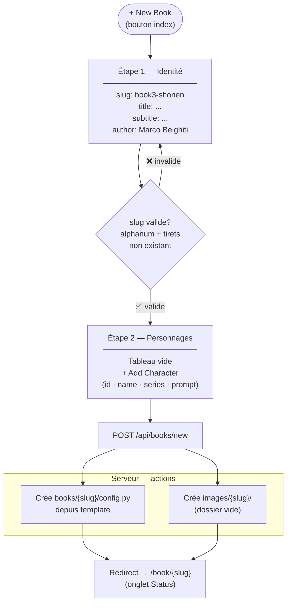

# Wizard — Création d'un nouveau livre

```mermaid
flowchart TD
    START(["+ New Book\n(bouton index)"])
    STEP1["Étape 1 — Identité\n─────────────────\nslug: book3-shonen\ntitle: ...\nsubtitle: ...\nauthor: Marco Belghiti"]
    VAL1{slug valide?\nalphanum + tirets\nnon existant}
    STEP2["Étape 2 — Personnages\n─────────────────\nTableau vide\n+ Add Character\n(id · name · series · prompt)"]
    SUBMIT["POST /api/books/new"]

    subgraph ACTION["Serveur — actions"]
        A1["Crée books/{slug}/config.py\ndepuis template"]
        A2["Crée images/{slug}/\n(dossier vide)"]
    end

    REDIRECT["Redirect → /book/{slug}\n(onglet Status)"]

    START --> STEP1
    STEP1 --> VAL1
    VAL1 -->|"❌ invalide"| STEP1
    VAL1 -->|"✅ valide"| STEP2
    STEP2 --> SUBMIT
    SUBMIT --> A1
    SUBMIT --> A2
    A1 --> REDIRECT
    A2 --> REDIRECT
```
