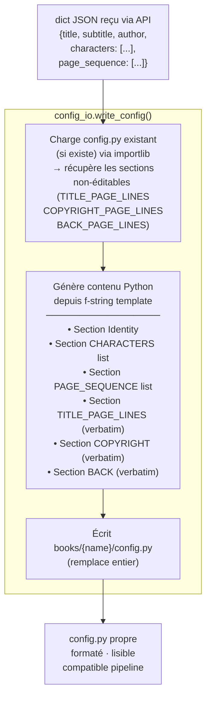

# config_io.py — Logique d'écriture de config.py

```mermaid
flowchart TD
    INPUT["dict JSON reçu via API\n{title, subtitle, author,\ncharacters: [...],\npage_sequence: [...]}"]

    subgraph WRITE["config_io.write_config()"]
        LOAD_EXISTING["Charge config.py existant\n(si existe) via importlib\n→ récupère les sections\nnon-éditables (TITLE_PAGE_LINES\nCOPYRIGHT_PAGE_LINES\nBACK_PAGE_LINES)"]
        TEMPLATE["Génère contenu Python\ndepuis f-string template\n─────────────────\n• Section Identity\n• Section CHARACTERS list\n• Section PAGE_SEQUENCE list\n• Section TITLE_PAGE_LINES (verbatim)\n• Section COPYRIGHT (verbatim)\n• Section BACK (verbatim)"]
        WRITE_FILE["Écrit books/{name}/config.py\n(remplace entier)"]
    end

    RESULT["config.py propre\nformaté · lisible\ncompatible pipeline"]

    INPUT --> LOAD_EXISTING
    LOAD_EXISTING --> TEMPLATE
    TEMPLATE --> WRITE_FILE
    WRITE_FILE --> RESULT
```
